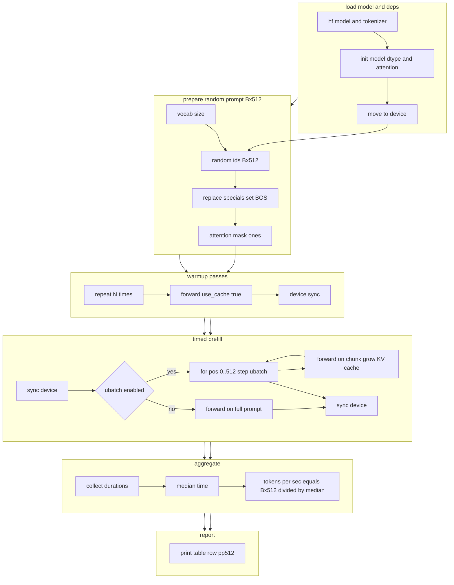

# pp512 Prefill Benchmark

## Process Diagram
**pp512** - это prefill на 512 токенах.



### Легенда
- **hf model and tokenizer** — загрузка модели и токенизатора из Transformers.
- **init model dtype and attention** — выбор точности и реализации внимания sdpa или flash attention 2 если доступно.
- **move to device** — перенос весов на GPU ROCm или CUDA.
- **prepare random prompt Bx512** — генерация случайных токенов формы Bx512, замена спец токенов, установка BOS и маска из единиц.
- **warmup passes** — несколько прогревов forward use_cache true с синхронизацией устройства.
- **timed prefill** — измеряем префилл одним вызовом или серией шагов с ubatch и накоплением KV кэша.
- **aggregate** — повторяем несколько раз, вычисляем медиану времени и итог tokens per sec.
- **report** — печать строки результата в стиле llama bench: pp512 и t s.


## Run options

```bash
# default
python app.py -m ./mistral --tests pp512 --dtype fp16 --batch 1 --attn sdpa --warmup 3 --iters 10 

# умеренный ubatch
python app.py -m ./mistral --tests pp512 --dtype fp16 --batch 1 --attn sdpa --ubatch 128 --warmup 3 --iters 10 

# более крупный ubatch
python app.py -m ./mistral --tests pp512 --dtype fp16 --batch 1 --attn sdpa --ubatch 256 --warmup 3 --iters 10 

# SDPA (как выше)
python app.py -m ./mistral --tests pp512 --dtype fp16 --batch 1 --attn sdpa  --iters 10 

# Eager (иногда на ROCm быстрее для некоторых кейсов)
python app.py -m ./mistral --tests pp512 --dtype fp16 --batch 1 --attn eager --iters 10 

# FlashAttention-2 (если установлен под ROCm)
python app.py -m ./mistral --tests pp512 --dtype fp16 --batch 1 --attn flash_attention_2 --iters 10 

# batch=2 для префилла (MI50 16–32ГБ обычно тянет FP16 7B)
python app.py -m ./mistral --tests pp512 --dtype fp16 --batch 2 --attn sdpa --ubatch 128 --iters 8 

# 4-бит (если есть bitsandbytes под ROCm)
python app.py -m mistralai/Mistral-7B-v0.1 --tests pp512 --quant 4bit --dtype fp16 --batch 1 --attn sdpa --iters 10 
```
