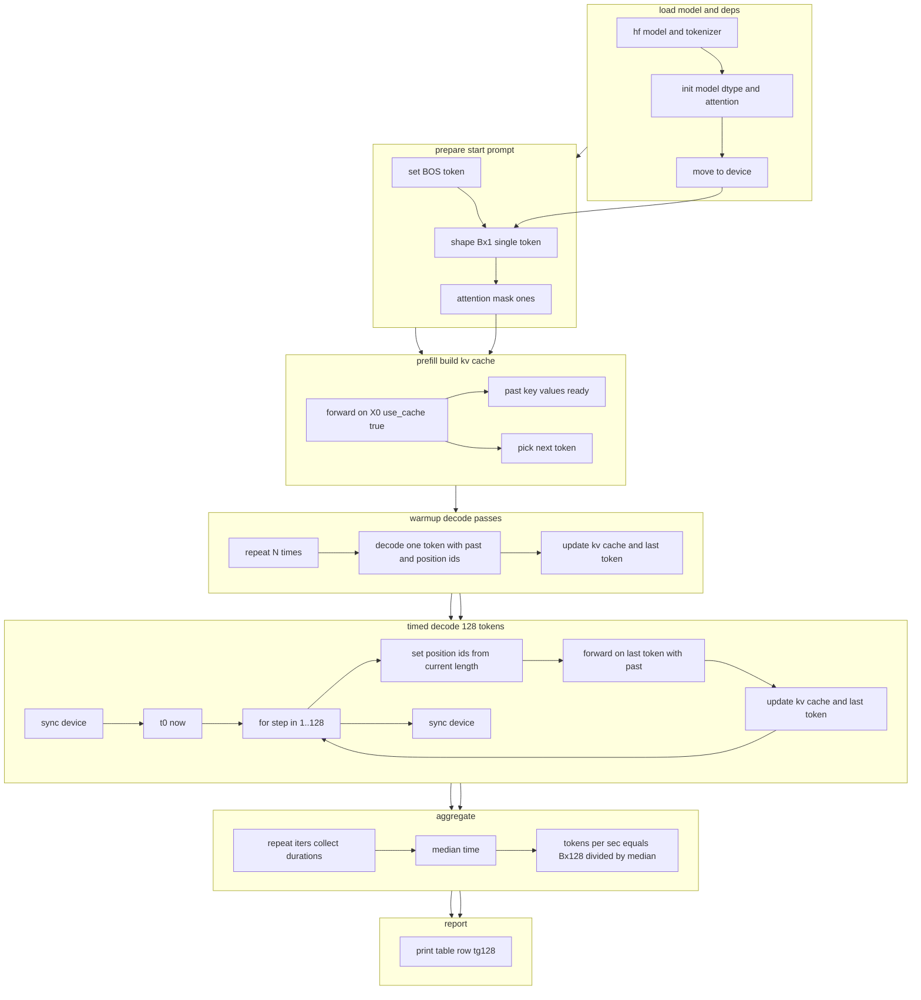

# tg128 Decode Benchmark — Process Diagram

## diagrmm
Ниже для теста **tg128** — это чистый decode на 128 токенов при включенном KV кэше.



### Легенда
- **hf model and tokenizer** — загрузка модели и токенизатора из 🤗 Transformers.
- **init model dtype and attention** — выбор точности и реализации внимания sdpa или flash attention 2 если доступно.
- **move to device** — перенос весов на GPU ROCm или CUDA.
- **prepare start prompt** — формируем начальный вход Bx1 обычно токен BOS и маска из единиц.
- **prefill build kv cache** — выполняем один forward чтобы заполнить kv кэш и получить первый следующий токен.
- **warmup decode passes** — несколько декод шагов без тайминга для прогрева по одному токену.
- **timed decode 128 tokens** — измеряем цикл из 128 декод шагов с past key values и position ids без пересчета полной маски.
- **aggregate** — повторяем несколько итераций берем медиану и считаем tokens per sec как Bx128 делить на медиану.
- **report** — печатаем строку результата в стиле llama bench tg128 и t s.

## Use cases

```bash
# default
python bench.py -m ./mistral --tests tg128 --dtype fp16 --batch 1 --attn sdpa --warmup 3 --iters 10

# Eager — иногда стабильнее/быстрее на ROCm для single-token decode
python bench.py -m ./mistral --tests tg128 --dtype fp16 --batch 1 --attn eager --iters 10

# FlashAttention-2 (если установлен под ROCm)
python bench.py -m ./mistral --tests tg128 --dtype fp16 --batch 1 --attn flash_attention_2 --iters 10 

# Умеренное увеличение batch (следи за памятью из-за KV)
python bench.py -m ./mistral --tests tg128 --dtype fp16 --batch 2 --attn sdpa --iters 8

# 4-бит для decode (если bnb доступен)
python bench.py -m mistralai/Mistral-7B-v0.1 --tests tg128 --quant 4bit --dtype fp16 --batch 1 --attn sdpa --iters 10


```
